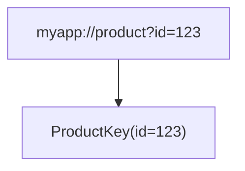

# Deep Link Guide

This guide shows you how to add [deep links](https://developer.android.com/training/app-links/create-deeplinks) using Navigation 3. To add deep links:

- Specify URI patterns for navigation keys
- Parse a URI from an Intent into a navigation key
- Add the navigation key to the back stack

## A simple example


## Specify a URI pattern for a navigation key
In Navigation 3, screens are represented by navigation keys. To deep link to a specific screen, specify a URI pattern that can be resolved to a navigation key.

For example, a product screen deep link could look like this: `example://gizmos?product?id=123`.

In this example, the product ID is `123` so the deep link is actually a URI _pattern_: `example://gizmos?product?id={$PRODUCT_ID}` where `PRODUCT_ID` represents the product ID.


## Parsing an Intent into a navigation key

When your app receives a deep link, convert the incoming `Intent` into a navigation key, such as an object that implements `NavKey`.

This process involves the following steps:

1.  **Define the URI patterns for each navigation key**: Create `DeepLinkPattern` objects that
    describe the URLs your app supports. These patterns link a URI structure to
    a specific `NavKey`.
2.  **Parse the request**: Convert the incoming `Intent`'s data URI into a
    readable format, such as a `DeepLinkRequest`.
3.  **Match the request to the pattern**: Compare the incoming request with your list
    of supported patterns to find a match.
4.  **Decode to the navigation key**: Use the match result to extract arguments and create an
    instance of the corresponding `NavKey`.

### Example Implementation

The `com.example.nav3recipes.deeplink.basic` package provides an example of
this flow.

**Step 1: Define Patterns**

In a file (e.g., `MainActivity`), define a list of supported deeplink patterns.
You can leverage the `kotlinx.serialization` library by annotating your Navigation keys with
`@Serializable`, and then use the generated `Serializer` to map deep link arguments to a
key argument.

For example:

```kotlin
internal val deepLinkPatterns: List<DeepLinkPattern<out NavKey>> = listOf(
    // URL pattern with exact match: "https://www.nav3recipes.com/home"
    DeepLinkPattern(HomeKey.serializer(), (URL_HOME_EXACT).toUri()),

    // URL pattern with Path arguments: "https://www.nav3recipes.com/users/with/{filter}"
    DeepLinkPattern(UsersKey.serializer(), (URL_USERS_WITH_FILTER).toUri()),

    // URL pattern with Query arguments: "https://www.nav3recipes.com/users/search?{firstName}&{age}..."
    DeepLinkPattern(SearchKey.serializer(), (URL_SEARCH.toUri())),
)
```

The sample `DeepLinkPattern` class takes the URL pattern and serializer for the associated
key, then maps each argument ("{...}") to a field in the key. Using the serializer,
`DeepLinkPattern` stores the metadata for each argument such as its KType and its argument name.

**Step 2: Parse the Request**

In your Activity's `onCreate` method, you will need to retrieve the deep link URI from the
intent. Then parse that URI into a readable format. In this recipe, we use a
`DeepLinkRequest` class which parses the URI's path segments and query parameters into a map. This
map will make it easier to compare against the patterns defined in Step 1.

**Step 3: Match Request to Pattern**

Next, iterate through your list of `deepLinkPatterns`. For each pattern,
use a matcher (e.g., `DeepLinkMatcher`) to check if the request's path and arguments align with
the pattern's structure. The matcher should return a result object containing the matched arguments
if successful, or null if not.

**Step 4: Decode to Key**

If a match is found, use the matched arguments to instantiate the corresponding `NavKey`.
Since we used `kotlinx.serialization` in Step 1, we can leverage a custom Decoder (`KeyDecoder`)
to decode the map of arguments directly into the strongly-typed key object.

```kotlin
override fun onCreate(savedInstanceState: Bundle?) {
    super.onCreate(savedInstanceState)

    val uri: Uri? = intent.data

    val key: NavKey = uri?.let {
        // Step 2: Parse request
        val request = DeepLinkRequest(uri)

        // Step 3: Find match
        val match = deepLinkPatterns.firstNotNullOfOrNull { pattern ->
            DeepLinkMatcher(request, pattern).match()
        }

        // Step 4: Decode to NavKey
        match?.let {
            KeyDecoder(match.args).decodeSerializableValue(match.serializer)
        }
    } ?: HomeKey // Fallback to home if no match or no URI

    setContent {
        val backStack= rememberNavBackStack(key)
        // ... setup NavDisplay
    }
}
```

For more details, refer to the [Basic Deep Link Recipe](../app/src/main/java/com/example/nav3recipes/deeplink/basic/README.md)
and the helper functions in the [util](../app/src/main/java/com/example/nav3recipes/deeplink/basic/util) package.

## Synthetic back stack & managing Tasks

Now we are ready to apply the Principles of Navigation. Their application is demonstrated
in the [deeplink.advanced](../app/src/main/java/com/example/nav3recipes/deeplink/advanced) and [deeplink.app](/advanceddeeplinkapp/src/main/java/com/example/nav3recipes/deeplink/advanced)
modules.

### Identifying the Task

First, how do you check which Task your Activity is started on? One of the most
common way to start an Activity in a new Task is by attaching the `Intent.FLAG_ACTIVITY_NEW_TASK`
flag to the deep link Intent.

In the Activity's `onCreate` method, you can access the Intent and check if that flag is present.

```kotlin
override fun onCreate(savedInstanceState: Bundle?) {
    super.onCreate(savedInstanceState)

    val flags = intent.flags
    val isNewTask = flags and Intent.FLAG_ACTIVITY_NEW_TASK != 0
    // ...
}
```
If `isNewTask` is true, the Activity is started in a new Task. Otherwise, the Activity
is started in the current Task.

### Applying Principle 1: Up and Back in New Task

If the Activity is started in a new Task, you will need to build a synthetic back stack to support
both Up and Back.

First, create an interface with a `parent` field that all deep link keys inherit.

```kotlin
interface DeepLinkKey: NavKey {
    val parent: NavKey
}

object HomeKey: NavKey

object UserListKey: DeepLinkKey {
    override val parent = HomeKey
}

class UserDetailKey(user: User): DeepLinkKey {
    override val parent = UserListKey
}
```

After you parse the deep link url into a key, build a synthetic back stack by iterating
up the key's parents.

```kotlin
fun buildSyntheticBackStack(
    deeplinkKey: DeepLinkKey,
): List<NavKey> {
    return buildList {
        var node: DeepLinkKey? = startKey
        while (node != null) {
            // ensure the parent is added to the start of the list
            add(0, node)
            val parent = if (node is DeepLinkKey) {
                node.parent
            } else null
            node = parent
        }
    }
}
```

**Note:** There are no hard rules as to what the "parent" key should be. In general it should
be the screen that is most natural / likely to come before the child key if the user
had manually navigated to the child key.

Now pass that returned back stack to the NavDisplay

```kotlin
val syntheticBackStack = buildBackStack(deeplinkKey)

setContent {
    val backStack: NavBackStack<NavKey> = rememberNavBackStack(*(syntheticBackStack.toTypedArray()))
    NavDisplay(
        backStack= backStack,
        // ...
    ) {
        // ...
    }
}
```

### Applying Principle 1: Up and Back in Original Task

If the Activity is started in the current Task, Up and Back buttons are handled differently.

#### Back button
You simply need to add the deeplink key to the back stack

```kotlin
setContent {
    // val deeplinkKey = parse deep link into key...
    val backStack: NavBackStack<NavKey> = rememberNavBackStack(deeplinkKey)
    NavDisplay(
        backStack= backStack,
        // ...
    )
}
```

Optionally you can also create a synthetic back stack appropriate to your app's needs.

#### Up button
Up button should never exit your app or return to the previous app. So you need to restart your
App in a new Task and then build a synthetic back stack as demonstrated above.

To restart the App, you will need a few things:
1.  the Context of the Activity
2.  the Activity itself
3.  the deep link url of the current screen's parent (remember, the current screen is technically
    already popped from the back stack once the user clicked Up)

Then build a TaskStackBuilder with an Intent containing the deep link url:

```kotlin
private fun createTaskStackBuilder(
    deeplinkKey: NavKey?,
    activity: Activity?,
    context: Context
): TaskStackBuilder {

    // The intent to restart the current activity
    val intent = if (activity != null) {
        Intent(context, activity.javaClass)
    } else {
        val launchIntent =
            context.packageManager.getLaunchIntentForPackage(context.packageName)
        launchIntent ?: Intent()
    }

    // Pass in the deeplink url of the parent key
    if (deeplinkKey != null && deeplinkKey is NavDeepLinkRecipeKey) {
        intent.data = deeplinkKey.deeplinkUrl.toUri()
    }

    // Ensure that the MainActivity is restarted as the root of a new Task
    intent.addFlags(Intent.FLAG_ACTIVITY_NEW_TASK or Intent.FLAG_ACTIVITY_CLEAR_TASK)

    // Lastly, attach the intent to the TaskStackBuilder
    return TaskStackBuilder.create(context).addNextIntentWithParentStack(intent)
}
```

Now start the activity:

```kotlin
fun navigateUp(
    // pass in required context, activity etc
) {
    if (onOriginalTask) {
        val taskStackBuilder = createTaskStackBuilder(deeplinkKey, activity, context)
        // ensure current activity is finished
        activity?.finish()
        // invoke restart
        taskStackBuilder.startActivities()
    }
}
```

You Activity should see that the `Intent.FLAG_ACTIVITY_NEW_TASK` is present and build a
synthetic back stack as demonstrated above.

### Applying Principle 2: The Up button never exits your app

Aside from restarting your Activity on a new Task, make sure your App's start destination does
not show the Up button

```kotlin
TopAppBar(
    // ...
    navigationIcon = {
        /**
         * Only display Up button if not on Root screen
         */
        if (currentKey != backStack.first()) {
            IconButton(onClick = {
                backStack.navigateUp()
            }) {
                // ...
            }
        }
    },
)
```
### Applying Principle 3: Deep linking simulates manual navigation

In general this means simulating a back stack as if the user had manually navigated from the
start destination to the deep linked destination, which is demonstrated in the above sections.

There is no hard definition for what the "correct" parent but some possible considerations
include:

1.  shortest path from start destination to deeplinked destination
2.  a parent that allows navigating to sibling destinations
3.  conditional parenting based on app state

## Summary

To summarize, the tables below show the recommended behavior of Up and Back buttons
depending on the Task.

**Existing Task**

| Task        | Target                      | Synthetic back stack                             |
|-------------|-----------------------------|-------------------------------------------------|
| Up Button   | Deep linked Screen's Parent | Restart Activity on new Task & build back stack  |
| Back Button | Screen before deep linking  | None                                            |

**New Task**

| Task        | Target                      | Synthetic back stack                            |
|-------------|-----------------------------|------------------------------------------------|
| Up Button   | Deep linked Screen's Parent | Build back stack on Activity creation           |
| Back Button | Deep linked Screen's Parent | Build back stack on Activity creation           |


### Important Terms & Concepts

**Task**: A collection of Activities arranged in a stack. A cohesive unit that can move from
the foreground to the background and vice versa. On a mobile device, each Task is represented by
one of the windows in the "recent apps" view when you swipe up from the bottom
of the screen. Each one of these windows (or Task) is usually marked with the launcher icon of
the App that is at the root of the Task stack. For more info see [this doc](https://developer.android.com/guide/components/activities/tasks-and-back-stack).

**BackStack**: Can be used to described a Task's stack. More commonly used to describe a stack of
destinations (or representations of destinations) that the user navigates through, starting from
the app's start destination to the current destination. Common operations on a back stack
include pushing new destinations onto the top of the stack (navigating forward), and popping
off destinations from the top of the stack (navigating back).

**Synthetic BackStack** A manually constructed stack of destinations that simulates
the path the user *would* have taken from the root destination to the current destination. This
path should represent the most natural or most likely sequence of screens that users would have
naturally navigated through in order to reach the current screen.

**Activity** A window in which an App draws its UI. An App may consist of one or more Activities.
See [this documentation](https://developer.android.com/guide/components/activities/intro-activities) for more details on Activities. Each App should have exactly
one "Launcher" Activity that serves as the entry point to the App, with optional additional
Activities that the user can navigate to.

**Task vs App vs Activity** As mentioned, a Task is a stack of Activities. You can think of the
App of the root Activity as the owner of this Task. It is also possible to start the Activity of
*another* app within this Task, such as when you deep link. For example *App A* owns *Task A*, and
App A deep links into *App B*'s Activity. In this scenario if you go to the "recent apps"
view (swipe up from the bottom of the screen), you will see that even though you are seeing
App B's screen, the launcher icon attached to the window is App A's. You will need to launch
App B's Activity in a brand new Task with App B as the root in order to be in App B's own Task.
